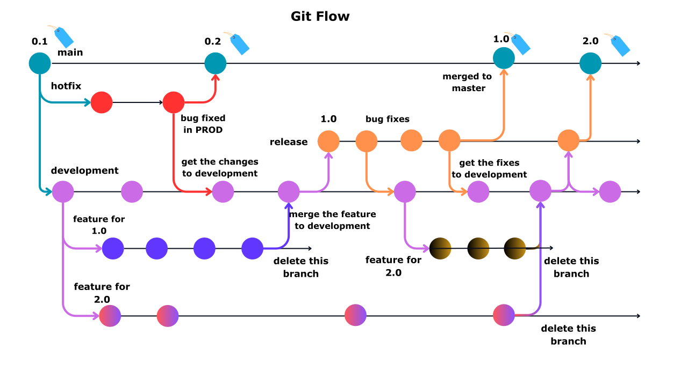

# Branching Strategy

A well-defined branching strategy is crucial for maintaining a clean, organized, and manageable codebase.

Here are some key reasons why having a branching strategy is important:
* Parallel Development
* Code Stability
* Code Reviews and Collaboration
* CICD

There are 3 popular branching strategies.

* Git flow
* Feature branching
* Trunk based

**Git Flow:**

